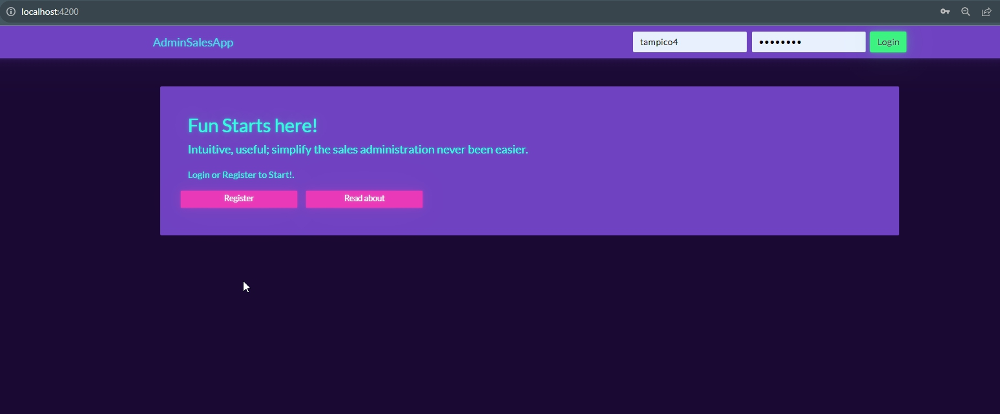
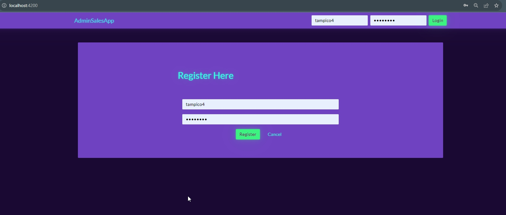
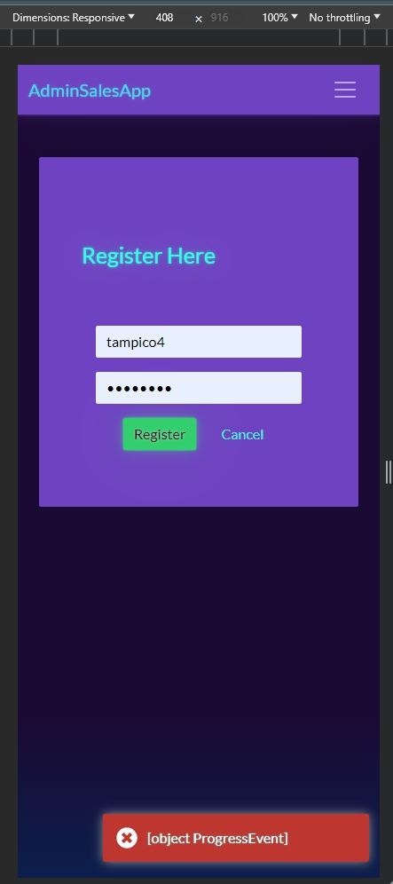

# Documentation

## Project 

- This project handdles the authentication process using a token from an API
- Authentication is JWT token based
- Allows to register (if service available)

## Screenshots

## Run

- `npm install`
- `ng serve`

